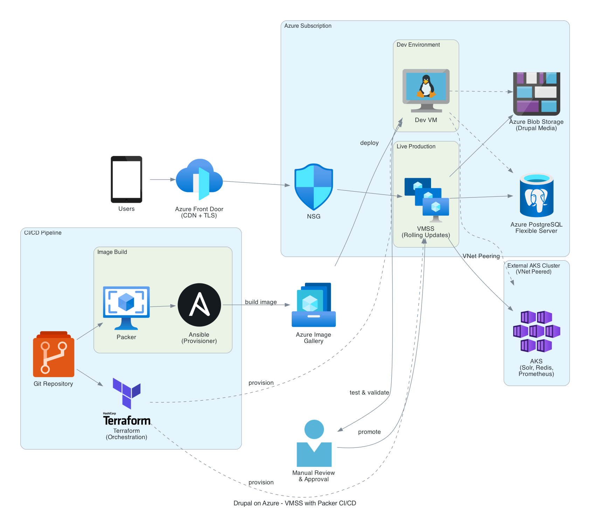
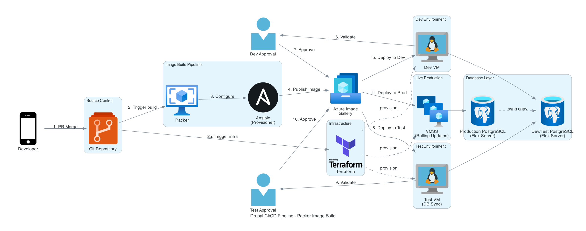

# Drupal on Azure - Infrastructure as Code

This project provisions Azure infrastructure for a **Drupal 11** application using **Packer-built images**, **rolling updates** to a single VMSS, and ephemeral **Dev/Test environments** for CI/CD pipelines.

## Architecture

### Production Architecture



The production deployment uses Azure Front Door as the entry point with CDN caching and TLS termination. Traffic flows through an NSG to a Virtual Machine Scale Set (VMSS) that receives rolling updates from pre-baked images stored in Azure Compute Gallery. Backend services include Azure PostgreSQL Flexible Server for the database and Azure Blob Storage for media files (accessed via S3Proxy + S3FS). An external AKS cluster (VNet peered) runs supporting services like Solr, Redis, and Prometheus.

### CI/CD Pipeline



GitHub Actions triggers Packer image builds that use Ansible as a provisioner. Built images are published to Azure Compute Gallery. The PR workflow deploys a Dev VM, syncs the database from production, validates, then deploys a Test VM for integration testing. The main workflow performs rolling updates to production VMSS with new image versions.

## Key Design Decisions

| Decision | Choice | Rationale |
|----------|--------|-----------|
| OS | Rocky Linux 9 | Enterprise-grade, RHEL-compatible, standardized across all VMs |
| Web Server | Apache with mod_proxy_fcgi | Better Drupal compatibility for CSS/JS aggregation |
| Image Strategy | Packer + Ansible → Azure Compute Gallery | Pre-baked images with PHP, Apache, Drupal dependencies |
| Deployment | Single VMSS with rolling updates | Simpler than Blue/Green, native Azure support |
| Database | PostgreSQL Flexible Server | Managed service with configurable tiers |
| Blob Storage | S3FS + S3Proxy | Azure lacks native S3 API; S3Proxy translates S3→Blob API |

## Project Structure

```
initiateAzure/
├── packer/                    # Packer image configuration
│   ├── drupal-rocky9.pkr.hcl  # Main Packer template
│   ├── variables.pkr.hcl      # Variable definitions
│   └── ansible/               # Ansible provisioner
│       ├── playbook.yml
│       └── templates/         # Apache, PHP-FPM configs
├── modules/                   # Terraform modules
│   ├── networking/            # VNet, subnets, NSG
│   ├── drupal-vmss/           # Production VMSS with rolling updates
│   ├── drupal-dev-vm/         # Ephemeral PR testing VM
│   ├── image-gallery/         # Azure Compute Gallery
│   ├── postgresql/            # Production database
│   ├── postgresql-devtest/    # Ephemeral PR database
│   ├── blob-storage/          # Drupal media storage
│   └── load-balancer/         # Public LB for PoC
├── environments/              # Environment configurations
│   ├── poc/                   # Proof of Concept deployment
│   ├── production/            # Production deployment
│   ├── dev/                   # PR validation (stage 1)
│   └── test/                  # PR validation (stage 2)
└── .github/workflows/         # CI/CD workflows
    ├── image-build.yml        # Build Packer image
    ├── pr-workflow.yml        # PR validation pipeline
    ├── deploy-production.yml  # Rolling update to production
    └── cleanup-pr.yml         # Destroy PR resources
```

## What's Baked Into the Image

The Packer-built image includes:

- **Rocky Linux 9** (Gen2, x64)
- **PHP 8.3** from Remi repository
- **Apache (httpd)** with mod_rewrite for clean URLs
- **PHP-FPM** pool configured for `drupal` user
- **Drupal 11** installed via Composer
- **Drush CLI** for site management
- **S3FS module** for Azure Blob Storage integration
- **S3Proxy** (Java 11 + S3Proxy 2.6.0) for S3→Blob translation
- **Composer** installed globally
- **Firewalld** with HTTP/HTTPS ports open
- **SELinux** configured for web serving

## Prerequisites

- Azure CLI authenticated (`az login`)
- Terraform >= 1.0
- Packer (for image building)
- Rocky Linux 9 marketplace terms accepted:
  ```bash
  az vm image terms accept --publisher resf --offer rockylinux-x86_64 --plan 9-base
  ```

## Quick Start

### 1. Create Image Gallery (One-time Setup)

```bash
# Create resource group for gallery
az group create -n drupal-images-rg -l canadacentral

# Create the gallery
az sig create \
  --gallery-name drupal_gallery \
  --resource-group drupal-images-rg \
  --location canadacentral

# Create the image definition
az sig image-definition create \
  --gallery-name drupal_gallery \
  --gallery-image-definition drupal-rocky-linux-9 \
  --resource-group drupal-images-rg \
  --location canadacentral \
  --os-type Linux \
  --os-state Generalized \
  --hyper-v-generation V2 \
  --architecture x64 \
  --publisher DrupalOrg \
  --offer drupal-rocky \
  --sku 9-php83
```

### 2. Build Packer Image

```bash
cd packer
cp variables.pkrvars.hcl.example variables.auto.pkrvars.hcl
# Edit with your subscription_id, gallery details, location

packer init .
packer build .
```

### 3. Deploy PoC Environment

```bash
cd environments/poc
terraform init

# Sequential deployment (recommended for first deploy)
terraform apply -target=azurerm_resource_group.poc -auto-approve
terraform apply -target=module.networking -auto-approve
terraform apply -target=module.load_balancer -auto-approve
terraform apply -target=module.postgresql -auto-approve
terraform apply -target=module.blob_storage -auto-approve
terraform apply -target=module.vmss -auto-approve
terraform apply -var="enable_vmss_blob_access=true" -auto-approve
```

### 4. Access Drupal

After deployment:

```bash
# Get the Load Balancer URL
terraform output lb_fqdn

# Get Drupal admin password
terraform output -raw drupal_admin_password
```

Access the site at `http://<lb_fqdn>` and log in with username `admin`.

## CI/CD Workflows

| Workflow | Trigger | Purpose |
|----------|---------|---------|
| `image-build.yml` | Push to main (packer changes) | Build and publish Packer image |
| `pr-workflow.yml` | PR opened/updated | Deploy Dev VM → Test VM → Validate |
| `deploy-production.yml` | Manual trigger | Rolling update to production |
| `cleanup-pr.yml` | PR closed | Destroy ephemeral PR resources |

## Terraform Modules

| Module | Purpose |
|--------|---------|
| `networking` | VNet, subnets, NSG with Front Door or LB rules |
| `drupal-vmss` | Production VMSS with rolling upgrades and autoscaling |
| `drupal-dev-vm` | Ephemeral VM for PR testing |
| `image-gallery` | Azure Compute Gallery for Packer images |
| `postgresql` | Production PostgreSQL Flexible Server |
| `postgresql-devtest` | Ephemeral PostgreSQL for PR testing |
| `blob-storage` | Storage account with managed identity access |
| `load-balancer` | Public Standard LB for PoC deployment |

## S3Proxy + S3FS Architecture

Azure Blob Storage doesn't natively support the S3 API. This project uses S3Proxy to translate S3 API calls:

```
Drupal (S3FS) → S3Proxy (localhost:8080) → Azure Blob Storage
```

S3Proxy runs as a systemd service on each VMSS instance, configured via cloud-init at boot.

## PoC vs Production

| Component | PoC | Production |
|-----------|-----|------------|
| Entry Point | Public Load Balancer | Azure Front Door |
| CDN/WAF | None | Front Door CDN + WAF |
| PostgreSQL | Burstable B1ms | General Purpose |
| VMSS Instances | 1 | 2+ with autoscaling |
| Blob Access | Public with firewall | Private endpoint |

## Provider Versions

- **azurerm**: ~> 4.57
- **Terraform**: >= 1.0
- **Packer**: ~> 2.0 (Azure plugin)

## License

[Add your license here]
